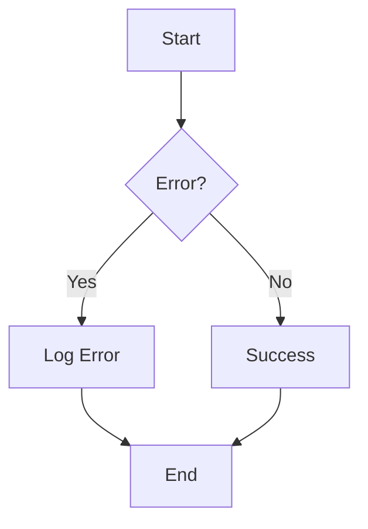

# Technical Writing & Documentation 2025

**Updated**: 2025-11-23 | **Focus**: API Docs, User Guides, Documentation as Code

---

## Technical Writing Principles

```markdown
CLARITY:
- Short sentences (15-20 words max)
- Active voice ("Click Save" not "Save should be clicked")
- Simple words ("use" not "utilize", "help" not "facilitate")
- One idea per sentence

BEFORE: "The utilization of the aforementioned methodology will facilitate the achievement of optimal outcomes"
AFTER: "Use this method to get the best results"

---

CONCISENESS:
- Remove filler words (very, really, actually, basically)
- Cut redundancy ("past history" → "history", "future plans" → "plans")
- Use lists (easier to scan than paragraphs)

BEFORE: "In order to start the process, you need to first click on the button that says 'Start'"
AFTER: "Click **Start**"

---

CONSISTENCY:
- Terminology (pick one term, stick with it)
  * DON'T mix: "log in", "sign in", "authenticate"
  * DO use: "log in" throughout
- Formatting (headings, code blocks, UI elements)
- Style guide (create, document, follow)

---

AUDIENCE AWARENESS:

EXPERTS:
- Technical depth (code examples, architecture diagrams)
- Assume knowledge (don't explain basic concepts)
- Focus on "how" and "why"

BEGINNERS:
- Step-by-step instructions
- Screenshots, visuals
- Define terms (glossary)
- Focus on "what" and "how"

MIXED AUDIENCE:
- Layer content (overview → details)
- Prerequisites section (what you need to know)
- Links to external resources (don't re-explain basics)
```

---

## Documentation Types

```markdown
API DOCUMENTATION:

STRUCTURE:

1. OVERVIEW:
   - What the API does
   - Authentication method
   - Base URL
   - Rate limits

2. GETTING STARTED:
   - Quick start (make first API call in <5 min)
   - Authentication example

3. REFERENCE:
   - Endpoints (list all)
   - For each endpoint:
     * HTTP method & path
     * Description
     * Parameters (required, optional, type, default)
     * Request example (code samples in multiple languages)
     * Response example (success & error)
     * Error codes

4. GUIDES:
   - Common use cases (tutorials)
   - Best practices
   - Troubleshooting

---

EXAMPLE (API Reference):

## Create User

POST /api/v1/users

Creates a new user account.

### Parameters

| Name | Type | Required | Description |
|------|------|----------|-------------|
| `email` | string | Yes | User's email address. Must be unique. |
| `name` | string | Yes | User's full name. |
| `password` | string | Yes | User's password. Minimum 8 characters. |
| `role` | string | No | User role. Options: `admin`, `user`. Default: `user`. |

### Request Example

```bash
curl -X POST https://api.example.com/api/v1/users \
  -H "Authorization: Bearer YOUR_API_KEY" \
  -H "Content-Type: application/json" \
  -d '{
    "email": "user@example.com",
    "name": "John Doe",
    "password": "securepassword123",
    "role": "user"
  }'
```

### Response Example

**Success (201 Created):**
```json
{
  "id": "usr_1234567890",
  "email": "user@example.com",
  "name": "John Doe",
  "role": "user",
  "created_at": "2025-11-23T10:30:00Z"
}
```

**Error (400 Bad Request):**
```json
{
  "error": {
    "code": "invalid_email",
    "message": "The email address is not valid"
  }
}
```

### Error Codes

| Code | HTTP Status | Description |
|------|-------------|-------------|
| `invalid_email` | 400 | Email format is invalid |
| `duplicate_email` | 409 | Email already exists |
| `weak_password` | 400 | Password doesn't meet requirements |
| `unauthorized` | 401 | Invalid or missing API key |

---

USER GUIDES:

STRUCTURE:

1. INTRODUCTION:
   - What is this product?
   - Who is it for?
   - Key features

2. GETTING STARTED:
   - Installation
   - Account setup
   - First task (quick win)

3. CORE FEATURES:
   - One section per feature
   - Step-by-step instructions
   - Screenshots (annotated with arrows, numbers)

4. ADVANCED TOPICS:
   - Power user features
   - Customization
   - Integrations

5. TROUBLESHOOTING:
   - Common issues (FAQ format)
   - Error messages & solutions
   - Contact support

---

STEP-BY-STEP FORMAT:

## How to Export Data

1. Click **Settings** in the top-right corner
2. Select **Export Data** from the menu
3. Choose a file format:
   - **CSV**: Opens in Excel, Google Sheets
   - **JSON**: For developers, API integrations
   - **PDF**: For printing, sharing
4. Click **Export**
5. Your file will download automatically

> **Note**: Large exports (>10,000 rows) may take up to 5 minutes

TIPS:
- Numbered lists (sequential steps)
- Bold UI elements ("Click **Save**")
- Inline notes (tips, warnings)
- Expected results ("You should see...")

---

RELEASE NOTES:

FORMAT:

## Version 2.5.0 - 2025-11-23

### New Features
- **Dark Mode**: Toggle in Settings > Appearance
- **Bulk Edit**: Select multiple items, edit at once

### Improvements
- Faster load times (30% improvement)
- Better mobile layout (responsive tables)

### Bug Fixes
- Fixed: Export button not working on Firefox
- Fixed: Search results showing duplicates
- Fixed: Incorrect date format in reports

### Breaking Changes
- Deprecated: `/api/v1/old-endpoint` (use `/api/v2/new-endpoint`)
- Changed: `user_type` field renamed to `role`

### Migration Guide
If you're upgrading from v2.4.x:
1. Update API calls to use `/api/v2/` endpoints
2. Replace `user_type` with `role` in your code
3. See [Migration Guide](link) for full details

---

README (GitHub projects):

ESSENTIAL SECTIONS:

# Project Name

Short description (one sentence)

## Features
- Feature 1
- Feature 2
- Feature 3

## Installation

```bash
npm install project-name
```

## Quick Start

```javascript
import { doSomething } from 'project-name';

doSomething();
```

## Documentation

Full docs: [https://docs.example.com](https://docs.example.com)

## Contributing

See [CONTRIBUTING.md](CONTRIBUTING.md)

## License

MIT License - see [LICENSE](LICENSE)

TIPS:
- Badges (build status, version, downloads)
- GIF/video demo (shows product in action)
- Link to live demo
- Keep concise (details in separate docs)
```

---

## Tools & Workflows

```markdown
DOCUMENTATION PLATFORMS:

STATIC SITE GENERATORS:

DOCUSAURUS (Meta):
- React-based
- Markdown files → website
- Versioning (v1, v2 docs side-by-side)
- Search (Algolia)
- Free, open-source
- Use: Developer docs (React, Jest use it)

MKDOCS:
- Python-based
- Markdown → website
- Themes (Material theme popular)
- Simple, fast
- Use: Technical docs, internal wikis

HUGO:
- Go-based
- Fast (builds large sites in seconds)
- Flexible theming
- Use: Documentation sites, blogs

---

HOSTED PLATFORMS:

GITBOOK:
- Hosted (no setup)
- Markdown editor (WYSIWYG or code)
- Git sync (GitHub integration)
- Free (public docs) or $7-12/user/month (private)
- Use: Product docs, knowledge bases

README.IO:
- Hosted API docs
- Interactive API explorer (try requests in browser)
- Auto-generate from OpenAPI spec
- $99-$399/month
- Use: API documentation (Stripe, Twilio use it)

NOTION:
- Wiki, docs, notes
- Collaborative editing
- Not markdown (proprietary format)
- Free (personal) or $8-15/user/month (teams)
- Use: Internal docs, wikis

---

DIAGRAMMING:

MERMAID:
- Text-based diagrams (code → visual)
- Integrates with Markdown
- Types: Flowcharts, sequence, class, ER, Gantt



DRAW.IO (DIAGRAMS.NET):
- Free, web-based
- Drag-and-drop (like Visio)
- Export: PNG, SVG, PDF
- Use: Architecture diagrams, flowcharts

LUCIDCHART:
- Professional diagramming
- Collaboration
- Templates (UML, network, flowchart)
- $8-30/user/month
- Use: Complex diagrams, team projects

---

SCREENSHOTS & ANNOTATIONS:

SNAGIT:
- Screenshot + annotation
- Arrows, text, blur (sensitive data)
- Video recording (screen capture)
- $63 (one-time)

MONOSNAP:
- Free screenshot tool
- Annotation
- Upload, share links
- Use: Quick screenshots, internal docs

LOOM:
- Video screen recording
- Narrate while recording
- Share via link
- Free (5 min limit) or $8/month (unlimited)
- Use: Tutorials, bug reports

---

VERSION CONTROL:

DOCS AS CODE:
- Store docs in Git (with code)
- Version control (track changes, revert)
- Review process (pull requests)
- Build & deploy (CI/CD)

WORKFLOW:
1. Write docs in Markdown
2. Commit to Git branch
3. Pull request (review, suggest edits)
4. Merge to main
5. Auto-deploy (Netlify, Vercel, GitHub Pages)

BENEFITS:
- Docs stay in sync with code
- Developers comfortable (Git workflow)
- Version history (see what changed, when, why)
```

---

## Style Guides

```markdown
VOICE & TONE:

VOICE (Consistent):
- Friendly but professional
- Conversational (not robotic)
- Helpful (you're guiding, not lecturing)

TONE (Varies by context):
- Tutorials: Encouraging, supportive ("Great job!")
- Error messages: Apologetic, actionable ("Sorry, something went wrong. Try X")
- Reference docs: Neutral, factual (just the facts)

---

GRAMMAR:

CONTRACTIONS:
- OK to use (you're, don't, can't)
- Makes writing conversational
- Exception: Formal contexts (legal, academic)

OXFORD COMMA:
- Use it ("apples, oranges, and bananas" not "apples, oranges and bananas")
- Avoids ambiguity

NUMBERS:
- 0-9: Spell out (one, two, three)
- 10+: Use numerals (10, 11, 100)
- Exception: Technical writing (all numerals: "3 files")

---

FORMATTING:

HEADINGS:
- Sentence case ("How to install" not "How To Install")
- Descriptive (not "Introduction", "Overview" - be specific)

CODE:
- Inline: `variableName`
- Blocks: Fenced code blocks with language

```python
def hello():
    print("Hello, world!")
```

UI ELEMENTS:
- Bold: **Save**, **Settings**
- Not quotes: Click "Save" ❌ → Click **Save** ✅

LISTS:
- Parallel structure (all start with verb or all nouns)
  * ✅ "Install software", "Configure settings", "Run tests"
  * ❌ "Install software", "Settings configuration", "Running tests"

LINKS:
- Descriptive text ("See the API reference" not "Click here")
- Open external links in new tab (UX best practice)

---

INCLUSIVE LANGUAGE:

AVOID GENDERED:
- "He/she" → "They" (singular they accepted)
- "Guys" → "Everyone", "Team", "Folks"

AVOID ABLEIST:
- "Sanity check" → "Quick check", "Validation"
- "Crazy" → "Unexpected", "Complex"

AVOID VIOLENT:
- "Kill the process" → "Stop the process", "Terminate"
- "Execute" (code) → OK (technical term), but "Run" clearer for beginners
```

---

## Information Architecture

```markdown
ORGANIZATION:

TASK-BASED:
- Organize by what user wants to do
- Examples:
  * "How to create an account"
  * "How to reset password"
  * "How to export data"
- NOT: "Account module", "Password class" (code-based, confusing)

PROGRESSIVE DISCLOSURE:
- Start simple → add complexity
- Layer 1: Quick start (get running in 5 min)
- Layer 2: Guides (common tasks)
- Layer 3: Reference (every option, parameter)
- Layer 4: Advanced (edge cases, optimization)

NAVIGATION:
- Sidebar (left): Categories, pages
- Breadcrumbs (top): Home > Category > Page
- Search (top right): Full-text search
- Table of contents (right): On-page sections

---

FINDABILITY:

SEARCH:
- Essential for large docs (100+ pages)
- Full-text search (Algolia, Elasticsearch)
- Autocomplete (suggest as you type)
- Filters (by category, version)

CROSS-REFERENCES:
- Link related pages ("See also: [Page]")
- Context-sensitive help (link from UI to docs)
- Breadcrumbs (show where you are in hierarchy)

KEYWORDS:
- Use terms users search for (not internal jargon)
- Example: Users search "delete account" not "account termination procedure"
```

---

## Metrics & Improvement

```markdown
ANALYTICS:

PAGE VIEWS:
- Which pages most visited? (prioritize updates)
- Which pages least visited? (improve SEO or remove)

SEARCH QUERIES:
- What are users searching for?
- 0 results → create content (gap in docs)
- High searches → prominently link (users can't find)

TIME ON PAGE:
- Short (<30 sec) → didn't find answer (improve content)
- Long (3+ min) → engaged (or lost/confused? test)

FEEDBACK:
- "Was this helpful?" (Yes/No buttons)
- Comment box ("What's missing?")
- Track: % helpful, common themes in comments

---

USER TESTING:

TASK-BASED:
- Give user a task ("Set up your account")
- Observe (don't help!)
- Where do they get stuck?
- What do they skip?

ASK:
- "What did you expect to happen here?"
- "Can you explain what this means?"
- "How would you do X?"

ITERATE:
- Test → Find issues → Fix → Re-test
- Continuous improvement (docs never "done")
```

---

## Key Takeaways

1. **Clarity** - Short sentences, simple words, active voice
2. **User-first** - Organize by tasks (what user wants to do), not code structure
3. **Examples** - Code samples, screenshots (show, don't just tell)
4. **Consistency** - Style guide, terminology, formatting
5. **Iterate** - Measure, get feedback, improve (living document)

---

## References

- "Docs for Developers" - Jared Bhatti et al.
- "Every Page is Page One" - Mark Baker
- Write the Docs (community)

**Related**: `api-documentation.md`, `docs-as-code.md`, `markdown-best-practices.md`
