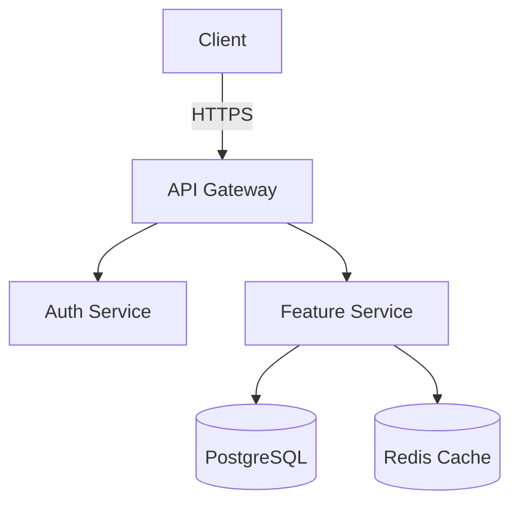

# CTO Technical Leadership 2025

**Updated**: 2025-11-23 | **Focus**: Architecture, Hiring, Tech Strategy

---

## The CTO Role Evolution

```
STARTUP CTO (0-50 employees):
- 80% hands-on coding
- 20% strategy/management
- Focus: Ship fast, find product-market fit

GROWTH CTO (50-200 employees):
- 50% architecture/reviews
- 30% hiring/team building
- 20% strategy
- Focus: Scale team and infrastructure

ENTERPRISE CTO (200+ employees):
- 70% strategy/leadership
- 20% architecture decisions
- 10% hands-on (POCs, critical bugs)
- Focus: Innovation, org efficiency
```

---

## Technical Strategy

### Technology Radar

```markdown
ADOPT (Use in production)
- React 19 Server Components
- TypeScript 5.9
- Kubernetes
- Postgres 15+
- GitHub Actions

TRIAL (Pilot projects)
- Rust for critical services
- Edge computing (Cloudflare Workers)
- Vector databases (Pinecone, Weaviate)
- LangChain for AI features

ASSESS (Research, POCs)
- Web3 integration
- Quantum-resistant cryptography
- Zero-trust architecture

HOLD (Avoid or phase out)
- Microservices for small teams (<20 engineers)
- GraphQL for simple APIs
- Blockchain for non-financial use cases
- Custom ML infrastructure (use managed services)
```

### Build vs Buy Framework

```python
def should_build(feature):
    """
    Decision framework for build vs buy
    """
    score = 0
    
    # Core differentiator?
    if is_core_competency(feature):
        score += 40
    
    # Unique requirements?
    if has_unique_requirements(feature):
        score += 20
    
    # Time-sensitive?
    if is_time_critical(feature):
        score -= 30  # Buy faster
    
    # Available solutions?
    quality_solutions = count_market_solutions(feature)
    score -= quality_solutions * 10
    
    # Team capacity?
    if team_has_capacity():
        score += 20
    
    # Total cost comparison
    build_cost = estimate_build_cost(feature)
    buy_cost = estimate_buy_cost(feature)
    
    if build_cost < buy_cost * 0.5:
        score += 30
    
    return score > 50

# Examples:
# Authentication: BUY (Auth0, Clerk) - Not differentiator
# Payment processing: BUY (Stripe) - Commodity
# Search: BUY (Algolia, Elastic) - Complex to build
# Core algorithm: BUILD - Your secret sauce
# Admin dashboard: BUY (Retool, AdminJS) - Generic
```

---

## Hiring & Team Building

### Engineering Levels

```
L3 - JUNIOR (0-2 years)
- Completes well-defined tasks
- Needs guidance on architecture
- Reviews: Requires approval
Comp: $80K-$120K

L4 - MID-LEVEL (2-5 years)
- Owns features end-to-end
- Designs components
- Reviews: Peers
Comp: $120K-$160K

L5 - SENIOR (5-8 years)
- Owns systems/services
- Mentors junior engineers
- Reviews: Sets standards
Comp: $160K-$220K

L6 - STAFF (8-12 years)
- Owns technical domains
- Influences roadmap
- Cross-team impact
Comp: $220K-$300K

L7 - PRINCIPAL (12+ years)
- Company-wide technical leadership
- Sets engineering culture
- External thought leadership
Comp: $300K-$500K
```

### Interview Process

```markdown
PHONE SCREEN (30 min)
- Resume deep-dive
- Culture fit
- Compensation alignment
Pass rate: 30%

TECHNICAL SCREEN (60 min)
- Live coding (LeetCode medium)
- System design discussion
- Questions about past projects
Pass rate: 40%

ONSITE (4 hours)
Round 1: Data Structures & Algorithms (60 min)
- 2 LeetCode medium problems
- Focus: Problem-solving, code quality

Round 2: System Design (60 min)
- Design [Instagram/Twitter/Uber]
- Scalability, tradeoffs, deep-dives

Round 3: Behavioral (45 min)
- Leadership principles
- Past conflicts & resolutions
- Career motivations

Round 4: Hiring Manager (45 min)
- Team fit
- Project interests
- Offer discussion

Pass rate: 50%

OVERALL CONVERSION: 30% × 40% × 50% = 6%
(Need 100 applications for 6 offers)
```

### Coding Interview Questions

```python
# Example: Design a URL shortener

"""
REQUIREMENTS:
- Generate short URL from long URL
- Redirect short URL to long URL
- Analytics (click tracking)
- Expire URLs after N days

SCALE:
- 100M URLs
- 1000 writes/sec
- 10K reads/sec

CONSTRAINTS:
- Short URL: 7 characters [a-zA-Z0-9]
- Low latency: <100ms p99
"""

import hashlib
import time

class URLShortener:
    def __init__(self):
        self.url_map = {}  # In production: Redis/DynamoDB
        self.counter = 0
        
    def encode(self, long_url: str, custom_alias: str = None, ttl: int = None) -> str:
        """
        Generate short URL
        
        Approach 1: Hash-based (MD5/SHA)
        - Pros: Deterministic, no collision
        - Cons: Longer output, hard to make 7 chars
        
        Approach 2: Counter-based (Base62 encoding)
        - Pros: Short, sequential
        - Cons: Predictable, needs distributed counter
        
        Approach 3: Random + collision check
        - Pros: Unpredictable
        - Cons: Needs retry logic
        
        CHOSEN: Counter-based with Base62
        """
        
        if custom_alias:
            if custom_alias in self.url_map:
                raise ValueError("Alias already exists")
            short_code = custom_alias
        else:
            self.counter += 1
            short_code = self._base62_encode(self.counter)
        
        self.url_map[short_code] = {
            'long_url': long_url,
            'created_at': time.time(),
            'ttl': ttl,
            'clicks': 0
        }
        
        return f"https://short.ly/{short_code}"
    
    def decode(self, short_url: str) -> str:
        """
        Redirect to long URL
        """
        short_code = short_url.split('/')[-1]
        
        if short_code not in self.url_map:
            raise KeyError("URL not found")
        
        entry = self.url_map[short_code]
        
        # Check expiration
        if entry['ttl']:
            age = time.time() - entry['created_at']
            if age > entry['ttl']:
                del self.url_map[short_code]
                raise KeyError("URL expired")
        
        # Track click
        entry['clicks'] += 1
        
        return entry['long_url']
    
    def _base62_encode(self, num: int) -> str:
        """
        Convert number to base62 (0-9, a-z, A-Z)
        """
        chars = "0123456789abcdefghijklmnopqrstuvwxyzABCDEFGHIJKLMNOPQRSTUVWXYZ"
        if num == 0:
            return chars[0]
        
        result = []
        while num > 0:
            result.append(chars[num % 62])
            num //= 62
        
        return ''.join(reversed(result))

# System Design Discussion Points:
"""
DATABASE SCHEMA:
Table: urls
- short_code (PK, varchar(7))
- long_url (text)
- created_at (timestamp)
- expires_at (timestamp, nullable)
- user_id (FK, nullable)

Table: analytics
- short_code (FK)
- timestamp (timestamp)
- ip_address (varchar)
- user_agent (text)
- referer (text)

CACHING:
- Redis for hot URLs (10K reads/sec)
- TTL: 1 hour
- Cache-aside pattern

SCALING:
- Read replicas for analytics
- Sharding by short_code hash
- CDN for static assets

AVAILABILITY:
- Multi-region deployment
- Active-active setup
- Eventual consistency OK

MONITORING:
- Latency: p50, p95, p99
- Error rate: 404s, 500s
- Cache hit rate
"""
```

---

## Architecture Reviews

### Design Doc Template

```markdown
# [Feature Name] Technical Design

**Author**: [Name]
**Reviewers**: [CTO, Tech Lead, Staff Engineers]
**Status**: Draft | In Review | Approved
**Created**: 2025-01-15
**Updated**: 2025-01-20

## 1. Overview

### Problem Statement
Users cannot [do X], which causes [business impact Y].

### Goals
- Enable users to [outcome]
- Reduce [metric] by 50%
- Support 100K concurrent users

### Non-Goals
- Mobile app (future iteration)
- Real-time collaboration (v2)

## 2. Background

### Current State
[Describe existing system, limitations]

### User Stories
As a [user type], I want to [action] so that [benefit].

## 3. Proposed Solution

### High-Level Design
[Architecture diagram - use Mermaid or draw.io]



### Data Model
```sql
CREATE TABLE features (
    id UUID PRIMARY KEY,
    user_id UUID REFERENCES users(id),
    data JSONB,
    created_at TIMESTAMP,
    updated_at TIMESTAMP
);

CREATE INDEX idx_features_user ON features(user_id);
```

### API Design
```
POST /api/v1/features
GET /api/v1/features/:id
PUT /api/v1/features/:id
DELETE /api/v1/features/:id
```

## 4. Alternative Approaches

### Option A: [Description]
Pros:
- [Benefit 1]
- [Benefit 2]

Cons:
- [Drawback 1]
- [Drawback 2]

### Option B: [Description]
[Similar structure]

**Decision**: Chose Option A because [reasoning]

## 5. Scalability

### Load Estimates
- DAU: 100K
- Requests/sec: 1000 (peak: 5000)
- Data size: 100GB (growth: 10GB/month)

### Bottlenecks
- Database writes (solution: write buffering)
- Cache invalidation (solution: pub/sub)

### Scaling Plan
- Horizontal: Auto-scaling (2-10 instances)
- Vertical: Upgrade DB (db.r5.xlarge → 2xlarge)
- Sharding: By user_id when >1TB

## 6. Security

### Authentication
- JWT with 15-minute expiration
- Refresh token (7 days)

### Authorization
- RBAC (admin, user, guest)
- Resource-level permissions

### Data Protection
- Encryption at rest (AES-256)
- Encryption in transit (TLS 1.3)
- PII anonymization in logs

## 7. Testing

### Unit Tests
- Business logic (>80% coverage)
- Edge cases, error handling

### Integration Tests
- API contracts
- Database operations

### Load Tests
- JMeter scenario: 5000 rps
- Target: p99 <200ms

## 8. Deployment

### Rollout Plan
- Week 1: 5% traffic (canary)
- Week 2: 25% traffic
- Week 3: 100% rollout

### Rollback Plan
- Feature flag (LaunchDarkly)
- DB migration backward-compatible
- Rollback time: <5 minutes

### Monitoring
- Latency: p50, p95, p99
- Error rate: <0.1%
- Custom metrics: [feature-specific]

## 9. Timeline

- Design review: Jan 15-20
- Implementation: Jan 21 - Feb 10
- Testing: Feb 11-15
- Deployment: Feb 16

## 10. Open Questions
- [ ] How to handle [edge case]?
- [ ] Should we support [feature X] in v1?

## 11. Appendix

### References
- [Similar system at Company X]
- [Research paper on algorithm Y]

### Prototype
[Link to POC code or demo]
```

---

## Technical Debt Management

### Debt Quadrant

```
HIGH IMPACT, EASY FIX → DO NOW
- Upgrade critical dependency (security)
- Fix N+1 query (performance)

HIGH IMPACT, HARD FIX → PLAN & SCHEDULE
- Migrate to microservices
- Rewrite legacy module

LOW IMPACT, EASY FIX → DO WHEN CONVENIENT
- Update old tests
- Refactor variable names

LOW IMPACT, HARD FIX → DON'T DO
- Rewrite working code for "best practices"
- Perfect test coverage (80% is fine)
```

### Debt Budget

```
SPRINT CAPACITY: 100 points

ALLOCATION:
- New features: 60 points (60%)
- Bug fixes: 20 points (20%)
- Tech debt: 20 points (20%)

QUARTERLY GOALS:
- Reduce P0 debt by 50%
- Upgrade all critical dependencies
- Improve test coverage from 60% → 75%
```

---

## Engineering Culture

### Core Values

```
1. OWNERSHIP
   "You build it, you run it"
   - Own production incidents
   - Monitor your services
   - On-call rotation

2. DATA-DRIVEN
   "In God we trust, all others bring data"
   - A/B test new features
   - Measure impact
   - Blameless postmortems

3. SIMPLICITY
   "The best code is no code"
   - Favor boring technology
   - Delete unused code
   - Minimize dependencies

4. SHIPPING
   "Done is better than perfect"
   - Ship fast, iterate
   - Feature flags for safety
   - Weekly deployments

5. LEARNING
   "Always be learning"
   - Lunch & learns
   - Conference budget
   - Internal tech talks
```

### Code Review Culture

```
GUIDELINES:
- Review within 24 hours
- Approve only if you'd maintain this code
- Praise good work ("Nice refactoring!")
- Suggest, don't demand ("Consider using X?")
- Link to docs/examples
- No bike-shedding (style is automated)

BLOCKERS (Must fix):
- Security vulnerabilities
- Data loss risk
- Breaks existing functionality
- No tests for critical paths

NON-BLOCKERS (Suggestions):
- Performance micro-optimizations
- Stylistic preferences
- Alternative approaches (if current works)
```

---

## Incident Management

### Incident Severity Levels

```
SEV-1 (CRITICAL)
- Complete outage
- Data loss
- Security breach
Response: Immediate, all-hands

SEV-2 (HIGH)
- Partial outage (>10% users affected)
- Major feature broken
Response: <30 minutes

SEV-3 (MEDIUM)
- Minor feature broken
- Performance degradation
Response: <4 hours

SEV-4 (LOW)
- Cosmetic issues
- Non-critical bugs
Response: Next sprint
```

### Postmortem Template

```markdown
# Postmortem: [Incident Title]

**Date**: 2025-01-15
**Duration**: 2 hours 15 minutes
**Severity**: SEV-2
**Impact**: 15% of users unable to login

## Timeline
10:00 - Alert fired (login errors spiking)
10:05 - Engineer A paged, started investigation
10:15 - Identified root cause (DB connection pool exhausted)
10:30 - Mitigation: Increased pool size
10:45 - Partial recovery (50% success rate)
11:30 - Full recovery
12:15 - Incident closed

## Root Cause
Database connection pool size (50) insufficient for traffic spike.
Traffic increased from 100 to 500 rps during flash sale.

## Impact
- 15K failed login attempts
- $50K in lost sales (estimated)
- 247 support tickets

## Action Items
- [P0] Set up auto-scaling for DB connections (@engineer-a, Jan 20)
- [P0] Add load testing to CI/CD (@engineer-b, Jan 25)
- [P1] Improve monitoring: alert on connection pool >70% (@engineer-c, Feb 1)
- [P2] Document runbook for DB issues (@engineer-d, Feb 15)

## What Went Well
- Quick identification (15 minutes)
- Clear communication in #incidents
- Documentation updated

## What Could Improve
- Should have predicted traffic spike
- Monitoring gaps (no pool size metric)
- Rollback took too long (no runbook)
```

---

## Key Metrics

```
DELIVERY METRICS:
- Deployment frequency: Daily (target)
- Lead time: <1 day (code → production)
- Change failure rate: <5%
- MTTR (Mean Time to Recover): <1 hour

QUALITY METRICS:
- Test coverage: >75%
- Bug escape rate: <2% (bugs in production)
- Technical debt: <20% of sprint capacity

TEAM METRICS:
- Retention: >90% annually
- eNPS (Employee Net Promoter): >40
- Promotion rate: 15-20% annually
```

---

## Key Takeaways

1. **Hire A-players** - One 10x engineer > ten 1x engineers
2. **Optimize for iteration speed** - Ship fast, learn fast
3. **Build > Buy for core competency** - Buy everything else
4. **Technical debt is OK** - Budget 20% for cleanup
5. **Culture > Process** - Values drive decisions

---

## References

- "The Staff Engineer's Path" - Tanya Reilly
- "An Elegant Puzzle" - Will Larson
- Stripe Engineering Blog
- Netflix Tech Blog

**Related**: `architecture-patterns.md`, `team-scaling.md`, `hiring-guide.md`
